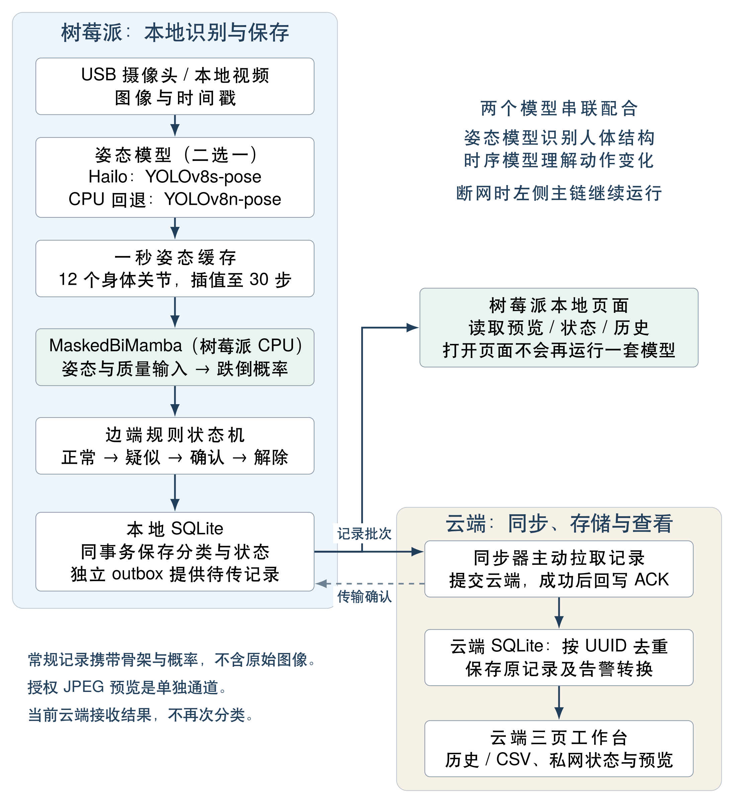
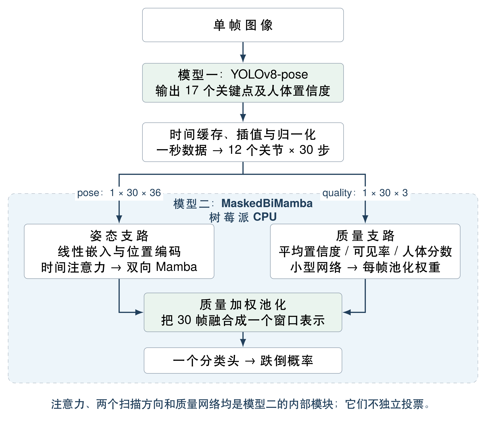

# FallGuard：系统工作流与模型协作说明

中文系统技术文档 · 更新：2026 年 10 月 7 日

本文说明我们的跌倒检测系统如何从摄像头画面走到告警记录，以及各个模型、程序和设备怎样配合。阅读不需要先理解 Mamba 的全部数学推导；需要公式细节时，可结合上一份《MaskedBiMamba：改进模型的数学原理、实现过程与实验效果》。

本文同步至2026年10月7日的源码、真实服务和工作台验收；9月20日的模型与硬件实验继续标明原日期。当前树莓派离线主链、云端接收和新版操作页面已经核对；仓库保留的浏览器及旧云端模式用于历史追溯。部署验收不是新的准确率或长期运行实验。

## 1. 先建立一个完整认识

### 1.1 整个系统在完成什么任务

FallGuard 将摄像头或视频中的人体动作转成连续的跌倒概率，再根据连续概率变化维护告警状态，将结果保存在本地，并在网络可用时同步到云端网页。

当前主链的顺序是：

**采集画面 → 提取人体骨架 → 形成一秒姿态窗口 → 判断跌倒概率 → 更新告警状态 → 本地保存 → 云端同步 → 网页查看与人工处理。**

前六步在树莓派上完成。即使没有网络，只要设备、电源、摄像头、运行环境和本地模型文件可用，识别和保存仍可继续。云端负责集中保存、展示和人工处理记录，而不是当前主链中每一次跌倒判断的必要前提。[S01–S05]

### 1.2 哪些是模型，哪些是程序

| 组件 | 它是什么 | 回答的问题 |
|---|---|---|
| YOLOv8-pose | 图像姿态估计模型 | 这一帧里人体的关节在哪里？ |
| MaskedBiMamba | 骨架时序分类模型 | 这一秒的姿态变化像不像跌倒？ |
| 告警状态机 | 确定性的程序规则 | 当前是否进入疑似、确认或解除状态？ |
| SQLite | 本地数据库 | 结果和状态是否已经可靠保存？ |
| 同步器 | 记录传输程序 | 哪些本地结果还没有被云端确认接收？ |
| 云端后端及网页 | 查询、推送、展示与处理程序 | 用户怎样查看记录并标记已处理？ |

因此，系统中的神经网络主要承担“看见身体”和“理解短时动作”两件事；记录存储、断网补传、状态规则和页面更新由软件工程模块完成。

Hailo 是运行姿态模型的加速硬件，ONNX Runtime 是执行导出模型的运行时。它们本身不是新增的跌倒判别模型。

### 1.3 两个模型怎样配合

YOLOv8-pose 接收图像，输出人体关键点和置信度。MaskedBiMamba 接收由这些关键点组成的一秒序列，输出跌倒概率。二者是**前后串联、分工互补**：

- 姿态模型将复杂图像转换为结构化的人体运动信息。
- 时序模型将多个时刻的人体结构组合成动作判断。

它们不是各自给出跌倒结论后再投票。当前程序也没有同时运行五个时序模型来决定一次告警。TCN、TE、TCNTE、UniMamba 是研究比较中的候选或对照，当前树莓派主链使用选定的 MaskedBiMamba 权重。[S01, S02, S06]

## 2. 系统全景：一条本地识别链，一条结果同步链

### 2.1 树莓派负责哪些事情

树莓派负责读取图像、调用姿态模型、管理带时间戳的骨架缓存、运行 MaskedBiMamba、更新告警状态、保存记录，以及提供本地预览和待传记录接口。

其中，Hailo-10H 在正常加速路径运行 YOLOv8s-pose；树莓派 CPU 运行图像预处理、姿态后处理、窗口构造、时序分类和存储逻辑。若以 `auto` 模式运行且 Hailo 不可用，姿态部分可回退到树莓派 CPU 上的 YOLOv8n-pose；后面的输入接口和分类器继续使用。[S01–S03]

### 2.2 云端负责哪些事情

云端同步器主动从树莓派读取尚未确认的分类记录，将其交给云端后端。后端在事务中保存原始记录和对应状态转换，提交成功后返回确认信息，同步器再通知树莓派把这批记录标记为已送达。

云端新版工作台通过 `/api/workspace/status` 轮询当前状态，通过 `/api/workspace/records` 查询自己的持久化历史；私有 outbox 代理本地页面的状态和预览。当前 `edge_offline` 记录已在树莓派分类，云端不会重复分类或重新判定一次告警。[S04, S05, S15]

### 2.3 为什么把识别与网络分开

如果每次分类都必须先把数据发送给云端，那么一次断网就会中断判断。现在分类先在本地完成，记录先落盘，联网仅影响远程可见性和送达时间。

这种分工也意味着：云端显示“数据过期”时，树莓派不一定已经停止识别；它也可能只是暂时无法把结果送到云端。本地页面和本地记录用于区分这两种情况。

## 3. 模型怎样从实验阶段进入运行系统

### 3.1 开发阶段与运行阶段是两条不同的流程

开发阶段决定“模型学成什么样”，运行阶段决定“如何用已经学好的模型处理新数据”。摄像头服务启动后不会现场训练，也不会根据最近几次告警自动更新模型权重。

开发流程依次为：

1. 整理视频、动作区间标注、受试者和数据来源清单。
2. 用姿态模型提取每段视频的关键点、置信度和时间戳，保存姿态缓存。
3. 按协议划分训练、验证和测试组，再建立滑动窗口及窗口标签。
4. 分别训练 TCN、TE、TCNTE、UniMamba、MaskedBiMamba，并执行消融及鲁棒性评价。
5. 根据验证集指标选择 checkpoint，在保留的测试数据上评价。
6. 选择部署权重，导出可在 CPU 上执行的双输入 ONNX 模型。
7. 把姿态模型文件、分类器文件及运行程序放到树莓派本地。[S06–S09]

### 3.2 为什么先缓存骨架，再训练分类器

姿态提取通常比短序列分类更耗时。把每段视频的姿态提取一次并缓存，可以让不同分类模型使用同一份输入，也避免每个训练 epoch 都重新执行图像网络。

训练脚本加载的是姿态窗口，而不是把视频图像直接送进一个端到端网络。因此当前时序训练的梯度不会反向更新 YOLOv8-pose。姿态模型和时序模型分别准备权重，通过输入数据契约连接，而不是联合优化成一个不可拆分的模型。[S07, S08]

### 3.3 每一种时序模型的角色

| 名称 | 在研究中承担的角色 | 是否参与当前树莓派每次分类 |
|---|---|---|
| TCN | 以时间卷积建模动作的基线 | 否 |
| TE | Transformer Encoder 基线 | 否 |
| TCNTE | 时间卷积加 Transformer 的组合基线 | 否 |
| UniMamba | 单向 Mamba 参照 | 否 |
| MaskedBiMamba | 加入遮蔽、注意力、双向和质量池化的模型 | 是，使用选定的一份权重 |

“系统比较过五种模型”与“系统同时运行五种模型”是不同的概念。主实验的 60 次训练是五种架构、四个划分和三个种子的组合，并不意味着树莓派要加载 60 份模型。[S06, S09]

### 3.4 当前部署的是哪份分类器

部署选择记录从主实验的 12 个 MaskedBiMamba checkpoint 中，依据验证 F1 选择了 `fold_3 / seed_3407 / epoch_41`，对应验证 F1 约为 0.708738。该值是模型选择依据，不能当作现场准确率。[S09]

导出后的 `masked_bimamba_quality.onnx` 有独立的 `pose` 和 `quality` 输入。Mamba 的固定 30 步扫描被转换为可移植操作，ONNX Runtime 在树莓派 CPU 上执行，不依赖训练时的 CUDA 扩展。[S08]

## 4. 第一步：采集或解码画面

### 4.1 USB 摄像头输入

摄像头采集由单独线程持续读取。主处理循环需要下一帧时，取得最新可用帧及其时间戳；它不会要求推理线程把摄像头产生的每一帧都顺序处理完。[S03]

这样做的目的是减少旧画面排队。例如姿态推理暂时变慢时，如果仍然逐帧处理积压图像，页面和判断可能越来越落后于现场；读取最新帧能够控制这一类积压。

代价是部分摄像头帧可能没有进入姿态网络。因此后面的窗口按真实时间戳构建，而不是简单把“最近收到的 30 帧”解释成一秒。

### 4.2 本地视频输入

对于测试或演示视频，程序先用 FFprobe 读取尺寸、编码和帧时间戳，再由 FFmpeg 解码图像。对 AV1 视频使用对应解码路径，并保留相对于视频第一帧的媒体时间。可选的 `--realtime` 会按原始播放速度等待；不启用时可以按设备处理能力回放。[S03]

视频回放仍然经过真实的姿态模型、窗口构造、分类器和保存逻辑。它不是把已经算好的标签直接显示到页面上。

### 4.3 两种时间不要混淆

摄像头记录的 UTC 时间来自采集线程的实际采集时间；视频的 `window_start`、`window_end` 等沿用媒体相对时间，而结果记录的 UTC `timestamp` 是本次读取或回放的时间，并非原视频历史拍摄日期。

这一点决定了云端怎样显示“发生时间”，也影响设备延迟测试的起点。文档或界面不能把视频里的第 3 秒直接当作当天 UTC 的第 3 秒。

## 5. 第二步：姿态模型把图像变成骨架

### 5.1 输入怎样准备

程序先按原图宽高比例缩放图像，并补边到 $640\times640$，避免直接把人物拉伸到正方形。颜色顺序转换为模型输入所需的 RGB。

Hailo 路径将图像送入本地 HEF 模型；CPU ONNX 路径进一步将图像转换为通道在前的浮点张量，并将像素值除以 255。[S02]

### 5.2 输出包含什么

姿态模型输出人体候选及 17 个 COCO 关键点。每个关键点由三项组成：

- $x$：关节在图像中的水平位置。
- $y$：关节在图像中的垂直位置。
- $c$：该关节的输出置信度。

后处理将坐标还原到原图对应的位置，并归一化到图像尺度，同时保留人体候选的检测置信度。没有超过候选阈值的目标时，当前实现返回全零关键点及零人体置信度。[S02]

### 5.3 Hailo 与 CPU 模型是什么关系

| 项目 | 正常加速路径 | 自动回退路径 |
|---|---|---|
| 姿态网络 | YOLOv8s-pose | YOLOv8n-pose |
| 运行位置 | Hailo-10H | 树莓派 CPU |
| 常用模型格式 | HEF | ONNX |
| 对后续模块的输出 | 17 点及人体置信度 | 同样的结构化接口 |
| 后续分类器 | MaskedBiMamba，CPU | 同一条 MaskedBiMamba 分类路径 |

二者通常是替代关系，不是并行投票关系。CPU 使用较小的 `n` 模型以支持回退；用于同规模性能比较的 `yolov8s-pose.onnx` 是另一个测试用途，不能与自动回退模型混为一谈。

`auto` 模式在 Hailo 初始化失败时尝试 CPU，运行中 Hailo 调用异常也会切换，并清空时序窗口以重新积累。显式指定 `hailo` 时失败会报错，不执行同样的自动回退。回退还依赖本地已有 CPU 权重；如果两条路径都不可用，程序不能凭空继续检测。[S01, S02]

### 5.4 多人画面怎样处理

当前实时姿态后端每帧只选择得分最高的一个人体候选，不维护多人的独立身份和时序窗口。因此本系统的当前实现不能描述为成熟的多人跟踪跌倒检测系统。

当多人同时进入画面时，最高分候选可能在不同帧变成不同的人，从而混合一秒内的骨架来源。这是当前运行方式的边界。

训练缓存提取脚本则使用追踪接口，优先维持已选择的 track；找不到该 track 时按候选面积选择。训练预处理与实时端在“选择哪个人”这一点上存在差异，后续若开展复杂多人场景，应先统一目标跟踪策略。[S02, S07]

## 6. 第三步：把逐帧骨架组织成一秒模型输入

### 6.1 为什么不能一拿到关键点就立即分类

YOLOv8-pose 描述的是一个时刻的人体几何。跌倒涉及变化过程，一帧的水平姿态既可能来自跌倒，也可能来自主动躺下，因此第二个模型需要连续一段时间的数据。

窗口构造器将每次姿态结果与时间戳、人体置信度一起放进缓存。满足约一秒覆盖后，最多约每 0.2 秒尝试一次分类。这个更新频率由当前处理速度限制，不能保证所有设备条件下都稳定达到每秒五次。[S01]

### 6.2 缓存需要满足哪些条件

当前实现依次检查：

1. 如果时间戳没有递增，或相邻收到的观测间隔超过 0.5 秒，清空旧缓存，重新开始。
2. 缓存时间覆盖尚不足一秒时继续积累。
3. 距上次分类尝试不足 0.2 秒时暂不计算。
4. 在保留的原始缓存观测中，至少一半观测需要拥有不少于 6 个置信度大于 0.2 的身体关节，否则跳过本次分类。[S01]

该质量门槛针对缓存观测，不要求一秒内必须完成 30 次真实姿态推理。当前一帧人体不完整时，若窗口里仍有足够有效观测，程序仍可能输出一次分类；页面另外检查当前姿态及结果新鲜度，避免把不适宜显示的结果当作当前判断。

### 6.3 从 17 点选取 12 个身体关节

分类器只保留编号 5 至 16 的左右肩、肘、腕、髋、膝、踝，排除五个面部点。骨架绘图与记录中仍可包含完整 17 点，而分类输入使用 12 点。二者数量不同并不矛盾。[S01, S06]

### 6.4 为什么还要插值成 30 步

设当前窗口为 $[t-1,t)$。系统在这一秒内设置 30 个等间隔采样时刻，对坐标、置信度和人体置信度分别做线性插值。

例如一秒内实际获得了约 20 次姿态观测，仍然可以形成 30 步输入；插值只是统一输入时间尺度，并不会创造额外的真实观测证据。帧率降低时，模型看到的是更稀疏观测的插值版本。

窗口是滑动的：如果在 1.0 秒输出一次结果，对应区间约为 $[0,1.0)$；在 1.2 秒更新，对应区间约为 $[0.2,1.2)$。相邻窗口有大量重叠，因此相邻分数也不是彼此独立的检测证据。

### 6.5 姿态输入和质量输入怎样生成

对每帧，代码分别在 12 个关节内部对 $x$、$y$ 做 min–max 归一化，再保留每个关节的置信度，得到 36 维向量。30 帧组合成：

$$
\texttt{pose}:1\times30\times36.
$$

与此同时，每帧构造三个质量特征：关节平均置信度、置信度不低于 0.2 的关节比例、人体检测置信度，组合成：

$$
\texttt{quality}:1\times30\times3.
$$

`pose` 告诉分类器身体怎样变化，`quality` 告诉分类器各帧的观测质量。这两路由相同姿态结果计算，随后一起输入同一个 MaskedBiMamba 模型，并不是两个独立的跌倒分类器。[S01, S06, S08]

## 7. 第四步：MaskedBiMamba 怎样利用这些信息

### 7.1 从输入到概率的内部顺序

第一步，36 维姿态向量投影到 64 维，并加入位置编码，让网络区分窗口里的先后位置。

第二步，时间自注意力比较窗口中的不同帧，形成包含全窗口关联的特征。这里的注意力是 MaskedBiMamba 的内部模块，不是额外串联一个完整、独立部署的 Transformer 分类模型。

第三步，两个独立的 Mamba 分支分别按正序和逆序处理同一个窗口，每个方向两层。逆序输出翻回原时间顺序，再与正序特征拼接和融合。两个方向合作产生一条特征序列，不分别投票。

第四步，质量网络根据每帧三维质量信息生成池化权重，把 30 帧融合成一个窗口表示。它是分类模型内部的小网络，由分类任务一起训练；不能直接理解为人工规定“置信度越高，权重就一定越高”。

最后，一个二分类头输出非跌倒和跌倒的两个 logits，再通过 softmax 得到跌倒概率。分类器执行一次，生成当前窗口的一条结果。[S06]

### 7.2 名字里的 Masked 在运行时是什么意思

训练时会随机将部分完整姿态帧置零，帮助模型接触不完整观测。真实部署推理时关闭这一随机增强，不会主动为了分类再随机丢掉 15% 的有效输入。

因此，运行流程图不应把“每次实时输入固定遮蔽 15%”列为必做步骤。传感器本身的缺失观测和训练期人工遮蔽也不是完全相同的过程。

### 7.3 为什么使用一秒窗口仍然需要持续更新

一秒窗口是一段局部观察，不能覆盖任意长的动作。程序不断滑动窗口，使模型逐渐看到跌倒前、变化中和变化后的不同片段。每次窗口计算相互独立，目前没有跨窗口传递 Mamba 隐状态。

概率只表达当前窗口在模型中的分类结果，不自动代表已经完成业务告警。后面还要经过状态机。

## 8. 第五步：从概率到告警状态

### 8.1 为什么模型分数与告警不是同一个东西

模型可能因弯腰、短暂遮挡或姿态跳变产生一个高分。若每次分数越过 0.5 就立即作为正式报警，会把单个窗口的波动直接传给用户。

实验中的 0.5 是窗口二分类阈值；实际状态机使用另一组阈值和连续计数规则。它不会改变模型权重，只将连续输出转换成业务状态。[S01]

### 8.2 四种状态及准确条件

| 状态 | 含义 | 当前代码中的主要进入条件 |
|---|---|---|
| `normal` | 当前没有活动告警 | 初始状态；或解除后再收到低分 |
| `suspected` | 已出现疑似证据 | 在正常或已解除状态，收到 $p\geq0.65$ |
| `confirmed` | 达到系统确认规则 | 处于疑似状态，连续高分计数至少 2，且最新一次 $p\geq0.82$ |
| `cleared` | 活动告警已按规则解除 | 处于疑似或确认状态，连续两次 $p\leq0.35$ |

每次 $p\geq0.65$ 时，高分计数加一、低分计数清零；每次 $p\leq0.35$ 时，低分计数加一、高分计数清零。若 $0.35<p<0.65$，两个计数都清零，但已有状态通常保持。

确认规则不要求两次都大于等于 0.82。例如连续收到 0.70、0.86，可以从疑似进入确认；0.70、0.70 则仍是疑似。正常状态下单次 0.95 只会先进入疑似。[S01]

### 8.3 停顿、解除和人工确认的区别

如果两次写入记录之间的系统时钟间隔超过两秒，代码只重置连续计数，不自动将已确认状态变成正常。没有人体或没有新窗口，也不等于系统已经获得“可以解除”的低分证据。

`cleared` 后再收到一次低分，边端状态回到 `normal`，但这次不产生单独的 `normal` 转换事件；该状态仍随普通分类记录保存。

人工在云端点击“确认事件/已处理”，含义是“用户已经查看并处理这条记录”。它不会修改模型概率，不等价于状态机进入 `confirmed`，也不会远程清除边端告警状态。传输成功的 ACK 则是第三种完全不同的确认，后文分别说明。[S01, S04, S05]

### 8.4 一个状态变化的手工例子

下面为解释规则而设定的示例，不是真实实验数据。假设每隔约 0.2 秒产生一个有效窗口，且之前状态为正常：

| 窗口结束时刻 | 跌倒概率 | 更新后状态 | 是否保存状态转换 |
|---|---:|---|---|
| 1.0 秒 | 0.12 | 正常 | 否 |
| 1.2 秒 | 0.70 | 疑似 | 是，`suspected` |
| 1.4 秒 | 0.86 | 确认 | 是，`confirmed` |
| 1.6 秒 | 0.58 | 保持确认 | 否；连续计数清零 |
| 1.8 秒 | 0.30 | 保持确认 | 否；第一次低分 |
| 2.0 秒 | 0.22 | 解除 | 是，`cleared` |
| 2.2 秒 | 0.18 | 正常 | 否；普通状态更新 |

七次有效分类均会保存分类记录，其中三次带有状态转换。因而“一条分类记录”“一条状态转换事件”“一次真实跌倒”并不是一一对应关系。

## 9. 第六步：把分类和状态一起写入本地数据库

### 9.1 每次有效分类保存什么

每个有效窗口的分类结果会生成一个 UUID 作为 `record_id`，并保存一条完整记录。主要字段包括：[S01]

| 信息类别 | 代表字段 | 用途 |
|---|---|---|
| 身份与时间 | `record_id`、`device_id`、`timestamp` | 唯一识别、归属设备、显示发生时间 |
| 分类结果 | `fall_probability`、`model` | 概率与模型来源 |
| 业务状态 | `alert_state`、`transition` | 当前状态和本次是否发生转换 |
| 窗口信息 | `window_start`、`window_end`、`window_observations` | 解释分类对应的时间和实际观测量 |
| 姿态信息 | `keypoints`、`pose_quality`、`valid_pose_fraction` | 骨架展示及质量追溯 |
| 运行信息 | `pose_backend`、`pose_ms`、`inference_ms`、`edge_fps` | 观察实际后端和运行耗时 |

`keypoints` 是当前处理帧的 17 点骨架，不是完整的 30 步窗口缓存。该记录能用于展示与追溯，但仅凭它不能重建模型这次分类的全部时序输入。

### 9.2 两张边端表如何配合

`outbox` 保存待同步记录，包含完整 JSON、顺序号、生成时间和送达确认时间；`alert_state` 按设备保存最新状态及高低分计数。

一次写入在同一个 SQLite 事务里完成：先读取原状态，再按本次概率更新，写入记录，并保存新的状态。这样避免“概率记录已经写入，但对应状态仍停留在上一次”的不一致。[S01]

数据库使用 WAL 和 `synchronous=FULL`。已有进程中断实验支持已提交记录和状态可以恢复；这不应扩大解释成任意硬盘损坏或整机断电条件下的数据保证。

### 9.3 已送达不等于删除

新记录的 `acknowledged` 为空，表示尚未收到云端传输确认。收到确认后，该字段写入时间，记录仍留在本地数据库。当前代码没有将已送达记录立即删除，也没有在此处实现无限期运行所需的自动容量清理策略。

独立的 outbox 服务读取同一数据库，因此摄像头或推理服务停止后，只要 outbox 服务仍运行，历史积压依然能够被云端读取。[S01, S10]

## 10. 第七步：云端如何接收和补传

### 10.1 谁主动发起网络请求

当前实现由**云端同步器主动拉取树莓派的记录**。不是每个推理窗口都从树莓派主动调用公网接口。

一次同步按以下顺序完成：[S04, S10]

1. 同步器请求边端 `/records`，读取按本地顺序排列、尚未确认的最多 100 条记录。
2. 同步器把完整记录批次提交给云端后端 `/api/edge/records`。
3. 云端验证字段和记录标识，在数据库事务中保存记录及状态转换。
4. 事务提交后，云端返回本批记录 ID。
5. 同步器检查返回的 ID 列表与提交批次一致，再调用边端 `/ack`。
6. 边端标记这些记录已送达；之后的 `/records` 不再返回它们。

没有积压时，同步器约每 0.5 秒轮询；仍有积压时，批次之间等待约 0.05 秒继续取下一批；请求失败后约一秒重试。处理耗时还会叠加，因此这些是程序等待参数，不是承诺的固定端到端时延。

### 10.2 重复发送为什么不会重复产生事件

云端 `edge_records` 表以 `record_id` 为主键。首次收到一条记录时，保存完整内容；相同 ID、相同内容再次出现时跳过写入，也不会再次生成状态转换事件。相同 ID 携带不同内容则报错，不会静默覆盖。[S04]

对于新记录，如果 `transition` 为疑似、确认或解除，就在同一事务中写入 `events` 表。普通无转换的记录保存进 `edge_records`，不创建新的转换事件。

因此，程序允许网络层重复传输，通过接收端去重取得不重复入库的效果。它不是依赖网络保证“每条消息只发送一次”。

### 10.3 ACK 丢失时会发生什么

考虑云端已经提交成功，但同步器还没来得及向树莓派确认就中断：树莓派的记录仍是待传，下一轮会再次取到；云端识别为同一 ID 的重复内容，不重复写入，然后重新返回确认，同步器再次通知树莓派。

若失败发生在云端提交之前，树莓派同样保留待传记录。关键顺序是**先完成云端持久化，再标记边端已送达**，从而避免记录尚未入库就从待传列表消失。[S04]

### 10.4 断网恢复后展示哪个时间

云端分别保存原始 `captured_at` 与接收时刻 `received_at`。事件沿用原记录时间，不能把网络恢复时间伪装成跌倒发生时间。

当前设备新鲜度也根据原始记录时间判断，而不是只看刚刚收到网络请求。较旧的积压可以补入事件历史，但不应因此被显示为刚发生的实时动作。对于最新设备视图，程序还避免用更旧记录覆盖已有更晚的观测。[S04, S05]

### 10.5 常规同步是否上传图像

常规分类记录不包含原始图像或视频，但包含当前帧 17 个骨架关键点，以及概率、质量、状态和运行信息。同步器将这些记录原样传给云端，云端保存完整 payload。[S01, S04]

另一方面，授权的远程预览可以单独传递带骨架标注的 JPEG 画面。它与分类记录同步是不同路径，预览文件位于边端临时运行目录，不是事件数据库中的视频档案。因此，“正常结果同步不上传原图”成立，但“任何使用方式都不会传图”不成立。[S01, S05, S11]

## 11. 第八步：本地页面与云端页面怎样工作

### 11.1 本地工作台读取已有结果并提供固定服务控制

树莓派本地页面通过独立服务提供，读取运行状态文件、最新预览 JPEG 和 SQLite 最近记录。它不会因为打开网页而再加载第二套姿态模型或分类器。[S12]

三个页面是检测概览、历史记录、设备与诊断：显示实时预览、当前有效判断、最近120条真实记录的概率趋势、状态与采集时间筛选、分页、最多10000条筛选CSV、本机温度/内存/磁盘/负载，以及记录总量与待传状态。断网时这些信息仍来自本机。启动/暂停按钮只控制固定用户摄像头服务，校验本机Host、同源Origin、JSON及随机页面令牌；暂停保留数据库和独立outbox。

为了避免旧结果误导用户，当前概率显示需要同时满足：状态文件足够新、当前帧有有效人体、最近预测距当前少于两秒，且概率是有效数值。否则显示“等待完整人体”“正在形成姿态窗口”或服务不可用，而不是把最后一次概率一直显示成当前结果。

### 11.2 云端页面怎样更新

新版工作台约每1.2秒轮询 `/api/workspace/status`，历史页请求 `/api/workspace/records`，CSV来自 `/api/workspace/export.csv`。概率曲线从云端最近120条真实记录绘制，超过2秒的间隔断开。私有状态接口由设备令牌保护；令牌留在后端，不进入浏览器。状态文件或判断过期、人体不完整时隐藏当前概率。[S05, S15]

树莓派不可达时，当前运行状态清空，待传数显示未知，但云端已接收记录仍可筛选、分页和导出。后端保留旧事件快照/SSE及备注接口用于兼容；当前工作台不显示人工备注按钮，不能把旧界面功能当作当前三页入口。

### 11.3 三种“确认”必须区分

| 名称 | 谁执行 | 改变什么 | 不代表什么 |
|---|---|---|---|
| 算法确认 `confirmed` | 边端状态机 | 当前告警状态 | 不代表用户已经查看 |
| 传输确认 ACK | 同步器与边端 outbox | 记录已被云端持久化的标记 | 不代表用户已经处理 |
| 人工确认/已处理 | 网页用户与云端后端 | 某条事件的处理时间及备注 | 不会自动解除边端状态 |

所以，本地待传数为零可以说明现存队列已确认送达，但不能说明没有告警，也不能单凭这一数值证明此刻网络仍然在线。

### 11.4 查看画面与控制摄像头是独立路径

云端当前状态与预览经后端访问私有outbox的 `/dashboard/status`、`/dashboard/preview`，由outbox读取本地页面。启动/停止继续沿用现有私有摄像头中继；后端额外校验完整HTTPS Origin、JSON与页面令牌。通用部署未配置中继时关闭远程控制。私有状态桥接只读，不提供摄像头控制。[S05, S10, S11, S15]

这条路径属于控制和观察，不是每次分类必须经过的数据通道。停止摄像头会停止产生新识别记录，但独立 outbox 仍可提供已有积压；关闭网页也不等于停止后台检测服务。

## 12. 仓库中其他模型与模式应怎样理解

### 12.1 当前树莓派模式

路径为 **YOLOv8-pose → 一秒骨架窗口 → 本地 MaskedBiMamba → 边端状态与存储 → 云端接收**。分类记录标识为 `edge_offline`，本文主要描述这一模式。

### 12.2 浏览器摄像头模式

项目保留历史MediaPipe浏览器资产、旧app.js和云端适配器供追溯。10月7日正式后端采用edge_offline入口，历史浏览器/云端模型推理接口返回不可用；当前工作台没有模型选择入口。过去的33点浏览器输入和云端缓冲流程不能用于解释当前树莓派一秒双输入模型。[S05, S13, S15]

### 12.3 旧树莓派上传姿态、云端分类模式

旧版程序曾由树莓派发送姿态，云端累计序列并运行分类器。相关脚本仍保留供追溯，但部署说明中旧姿态拉取分类服务已经停用，当前改为拉取本地分类记录。[S05, S13]

因此，在解释当前系统时不能同时画成“树莓派本地分类一次”和“相同数据再由云端分类一次”，也不能把旧云端几何后备规则当作当前 MaskedBiMamba 主链的一部分。

### 12.4 YOLO 检测器改动文件与主时序模型

项目其他目录中还保存检测器训练、结构修改和参考材料。判断某个模型是否在当前链路中使用，应看当前服务启动参数和实际加载文件，而不能因为仓库里存在某个模型名称，就把它加入系统流程图。

目前主链证据指向 YOLOv8 姿态前端与 MaskedBiMamba 时序分类器。TCNTE 等基线的价值是验证研究方案，不是充当该主链的前置筛选或二次复核模型。[S01, S06, S10]

## 13. 用一次完整事件串起所有模块

以下为说明协作关系的假设场景，不是真实录像或实验测量。

**启动阶段。** 开机后，摄像头服务加载本地姿态模型与 MaskedBiMamba；outbox 和本地网页服务分别启动。分类器刚启动没有一秒缓存，因此页面显示正在形成窗口。

**正常活动。** 摄像头采集最新画面，姿态模型持续输出关节点。窗口满足时间覆盖与质量门槛后，分类器定期输出低概率，边端保存普通记录。云端同步器读取这些记录，页面显示正常状态与骨架。

**动作突变。** 某人出现快速姿态变化。第一帧异常并不直接产生最终跌倒结论，它先作为骨架进入窗口；当一秒序列形成相应特征时，MaskedBiMamba 的概率可能升高。

**形成告警。** 如果连续窗口达到第 8 章的规则，边端从正常变为疑似，再变为确认。每次状态转换与其概率记录一起落盘。此时即使网络断开，边端的状态判断已经完成。

**断网积压。** 同步请求失败，记录仍然保存在本地，待传数随新分类增加。本地页面可继续读取当前概率和历史，而云端可能显示该设备数据过期。

**恢复网络。** 同步器按顺序取批，云端将原始记录及疑似、确认等转换写入数据库，提交后确认。树莓派将相应记录标记为已送达，待传数下降。事件历史保留原记录时间；设备视图另外显示云端接收或更新时间，新鲜度仍按原采集时间判断。

**现场恢复。** 后续连续低分使边端按规则进入解除，再回到正常。这取决于新的观测，不取决于工作人员是否点击过网页上的处理按钮。

**人工处理。** 工作人员查看确认事件和备注，并标记已处理。这一步记录人为响应，完成的是事件处置记录，而非重新运行模型。

## 14. 出现异常时，哪个模块继续工作

| 场景 | 程序当前行为 | 对用户可见结果的影响 |
|---|---|---|
| 暂时没有完整人体 | 写入姿态观测；窗口不足有效观测时跳过分类 | 本地页面隐藏不适用的当前概率，等待有效人体 |
| 摄像头帧率下降 | 获取最新帧，按时间戳构造窗口 | 分类更新可能变慢；插值不恢复真实缺失信息 |
| 观测间断超过 0.5 秒 | 重置时序缓存 | 重新积累约一秒后才可能产生新分类 |
| Hailo 异常且使用 auto | 转到本地 CPU 姿态模型，清空窗口 | 前端速度及姿态输出分布可能变化 |
| 网络中断 | 本地推理、状态和保存继续；同步重试 | 本地可看，云端记录延后出现 |
| 云端已入库但 ACK 丢失 | 之后再次发送，云端按 ID 去重 | 不重复产生同一记录对应的转换事件 |
| 摄像头服务停止 | 不再产生新结果；独立 outbox 可继续读取历史 | 历史可补传，实时视图失去新鲜度 |
| 云端服务重启 | 已提交数据库记录保留，后端从最后记录恢复历史设备视图 | 页面重新读取私网当前状态；历史记录不冒充当前判断 |
| 边端进程重启 | 从 SQLite 恢复记录和持久化状态；重新建立姿态窗口 | 已提交数据可恢复，但暂时没有新的完整窗口 |
| 本地模型文件缺失 | 对应后端无法加载；若无可用回退则启动失败 | 服务不可用，不能视为“判定没有跌倒” |

表中是当前代码逻辑及已有记录支持的行为，不把未测试的任意异常都归入自动恢复范围。例如目前没有说明数据库磁盘耗尽后的完整处置策略，也没有把多人候选切换识别为独立身份切换事件。[S01–S05, S10–S12]

## 15. 已有测试分别验证了哪一段工作流

### 15.1 模型实验验证识别效果

主实验、消融、缺帧及外部测试回答的是分类器在指定数据和协议下的表现。它们不能单独证明实际摄像头采集、断网队列或云端页面已经工作。

完整模型在 30% 随机整帧缺失的主协议下，窗口 F1 为 0.6276，TCNTE 为 0.4361；这一结果支持特定缺帧设置下的模型稳定性，不意味着摄像头持续无人体或任何遮挡时仍能可靠报警。详细口径已在数学与实验文档中展开。[S09]

### 15.2 设备回放验证实际推理链

已保存的 40 段合成视频测试经过真实解码、姿态提取、窗口分类和保存，共处理 3,240 帧、生成 663 次分类。20 段正类视频均出现阳性预测；20 段负类视频中有 8 段误报、11 段正确、1 段无有效输出。[S14]

这些结果说明设备链路可以工作，也显示当前仍有误报和无输出问题。视频级“某处曾经阳性”并不等价于在跌倒动作开始后立即确认。

### 15.3 性能测试解释算力如何分工

同规模 YOLOv8s 路径的对照中，CPU ONNX 完整流程约为 1.73 fps，Hailo 路径约为 20.56 fps；Hailo 流程中的 MaskedBiMamba CPU 分类约为每窗口 7.7 ms。[S14]

这说明在所测链路里，图像姿态阶段是值得加速的部分，短序列分类可以继续交给 CPU。20.56 fps 是整条处理流程的帧率，不能当作时序模型每秒告警次数；7.7 ms 也不包含一秒窗口积累和网络送达。

### 15.4 存储与同步测试验证结果交付

已有记录显示：连续离线约 603.82 秒完成 11,016 帧处理和 2,312 次分类；强制终止写入进程后，100 条已提交记录及对应状态恢复。真实上传链路阻断 30 秒期间积压 17 条记录，恢复后约 2.83 秒观察到队列清空；累计 85 条边云记录的标识与采集时间逐条一致。[S14]

正常联网测试中，34 条记录从末帧采集到云端接收的时间中位数为 1.45 秒。这个指标从窗口末帧计时，不是从跌倒动作开始计时，也不是分类器单次计算时间。

### 15.5 三个速度指标应该怎样分开讲

| 指标 | 描述什么 | 不应替代的指标 |
|---|---|---|
| 帧处理速度 | 解码、姿态与整条流水处理图像的速度 | 每秒产生多少正式告警 |
| 每窗口分类耗时 | 已备好输入后，时序模型运行多久 | 从动作开始到确认的时间 |
| 末帧至云端接收时间 | 一条结果经过计算、保存和同步的送达耗时 | 整个跌倒事件的感知与响应时延 |

一秒窗口、滑动步长、连续确认规则、设备计算和同步各自影响时间行为，不能用一个毫秒数概括整套系统的响应。

## 16. 对外讲解时可以直接使用的描述

我们的系统先由摄像头获取人体画面，再用运行在 Hailo 上的 YOLOv8-pose 提取关节点和置信度。树莓派把这些结果按时间戳组织成一秒窗口，选取 12 个身体关节并重采样为 30 步，然后将姿态和质量信息一起交给 CPU 上的 MaskedBiMamba。这个模型综合窗口内的动作变化，输出一个跌倒概率。

概率还会经过边端状态机，根据连续高分和低分决定疑似、确认和解除。每次分类结果与更新后的状态一起保存到本地 SQLite，因此网络断开时，检测和记录仍可以继续。云端同步器在网络可用时读取待传记录，先在云端完成保存，再确认给树莓派，从而支持重试和去重。新版网页展示当前预览、有效状态、分类历史与设备诊断；旧后端人工备注接口保留用于兼容。

因此，姿态模型与时序模型通过“人体骨架序列”串联配合，告警规则负责把概率转成业务状态，存储和同步模块负责让结果可保存、可送达、可查看。当前树莓派主链不需要 TCN、Transformer 等所有基线共同投票，也不依赖云端再次分类。

## 附录 A. 数据接口速查

| 上游 → 下游 | 传递的数据 | 典型形状或内容 |
|---|---|---|
| 采集器 → 姿态模型 | 图像及时间 | 原始画面，预处理到 $640\times640$ |
| 姿态模型 → 缓存器 | 关键点与人体置信度 | 17×3，另有一个人体分数 |
| 缓存器 → MaskedBiMamba | pose 与 quality | 1×30×36；1×30×3 |
| 分类器 → 状态机 | 跌倒概率及窗口信息 | 概率、窗口起止、质量及耗时 |
| 状态机 → SQLite | 带唯一标识的完整结果 | 当前状态、转换、17 点骨架和元数据 |
| outbox → 云端同步器 | 未确认记录批次 | 最多 100 条 JSON 记录 |
| 云端后端 → 同步器 → outbox | 传输确认 | 已提交记录的 UUID 列表 |
| 云端后端 → 网页 | 工作台状态、预览与分类历史 | 同源HTTP轮询、JSON/JPEG、筛选与CSV |
| 网页 → 云端后端 | 固定摄像头启停 | 同源JSON、页面令牌；已有私有中继 |

## 附录 B. 运行服务速查

| 服务 | 运行位置 | 主要责任 |
|---|---|---|
| `fallguard-camera.service` | 树莓派 | 摄像头、本地姿态和分类、状态及落盘 |
| `fallguard-outbox.service` | 树莓派 | 令牌保护的待传记录/ACK及只读状态、预览桥接 |
| `fallguard-local-ui.service` | 树莓派 | 三页本机工作台、历史/CSV、诊断和固定服务控制 |
| `fallguard-relay.service` | 树莓派 | 摄像头控制、状态和授权预览中继 |
| `fallguard-edge-sync.service` | 云端 | 拉取边端记录、提交后端并回写 ACK |
| `fallguard.service` | 云端 | 应用后端、记录/事件存储及推送 |
| `fallguard-public.service` | 云端 | 对外 HTTPS 入口 |

已停用的旧 `fallguard-pull.service` 与当前 `fallguard-edge-sync.service` 作用不同：前者关联旧姿态流，后者搬运已经完成分类的本地记录。[S05, S10]

## 附录 C. 源码和证据索引

下列路径以项目目录 `小组项目/跌倒检测/` 为根。本文中的 S 编号是来源定位，不是新的实验编号。涉及运行状态的描述来自已保存部署记录；流程细节直接对照当前源代码。

- **S01 边端主流程**：`webui/edge/offline/edge_runtime.py`。重点为 `Store.add`、`Classifier.add` 和 `main`。
- **S02 姿态前端**：`webui/edge/offline/pose_backend.py`。重点为 `HailoPose`、`CpuPose`、最高分候选及坐标变换。
- **S03 图像输入**：`webui/edge/offline/video_input.py`。重点为 `CameraInput` 与 `VideoInput`。
- **S04 同步与接收**：`webui/cloud/pull_edge_records.py`、`webui/edge_ingest.py`。
- **S05 云端与页面**：`webui/server.py`、`webui/cloud_workspace.py`、`webui/index.html`、`webui/cloud/README.md`。
- **S06 模型定义与配置**：`code/src/fallbench/models.py`、`code/configs/main_protocol.yaml`。
- **S07 数据及训练流程**：`code/scripts/extract_pose.py`、`make_splits.py`、`build_windows.py`、`train.py`，以及 `code/src/fallbench/data.py`。
- **S08 模型导出**：`code/scripts/export_mamba_onnx.py`。
- **S09 模型选择及实验依据**：`webui/edge/offline/deployment_selection.json`，以及 `实验结果/gmdcsa24_gpu_2026-09-18/outputs/` 下主实验与鲁棒性汇总。
- **S10 边端服务与独立队列**：`webui/edge/offline/outbox_server.py`、`fallguard-camera.service`、`fallguard-outbox.service`；云端 `webui/cloud/fallguard-edge-sync.service`。
- **S11 控制与预览中继**：`webui/edge/pose_relay.py` 及 `webui/server.py` 的摄像头接口。
- **S12 本地页面**：`webui/edge/offline/local_dashboard.py`、`local_dashboard.html`、`fallguard-local-ui.service`。
- **S13 浏览器及兼容模式**：`webui/cloud_model.py`、`webui/app.js`、`webui/cloud/README_before_offline.md`；当前是否启用仍以 S05 的部署说明为准。
- **S15 当前工作台与部署验收**：`结题报告/review_2026-10-07/README.md`、`cloud-workspace-validation.json`、`pi-dashboard-validation.json`，以及公共仓库 `results/deployment/`。
- **S14 已有验收记录**：`结题报告/树莓派测试说明.md`、`结题报告/补充实验记录.md`，及 `结题报告/review_2026-09-20/pi_results/` 下的原始记录。

本文与上一篇数学文档互为补充：上一篇解释模型内部“怎样算、为什么这样算”，本篇解释系统各模块“先做什么、把什么交给谁、失败后怎样继续、用户最终看到什么”。

## 2026-10-07 部署快照

本地版本2026.10.07，云端2026.10.07-cloud；云端三个服务正常，树莓派摄像头、outbox和页面为active/enabled。升级保留3304条分类窗口和306条云端事件；核对时待传0，画面无完整人体，当前概率为空。21项后端/集成测试和两个实际页面脚本检查通过。服务记录数不等于跌倒次数或实验样本量；该日期快照不替代9月硬件实测。[S15]
